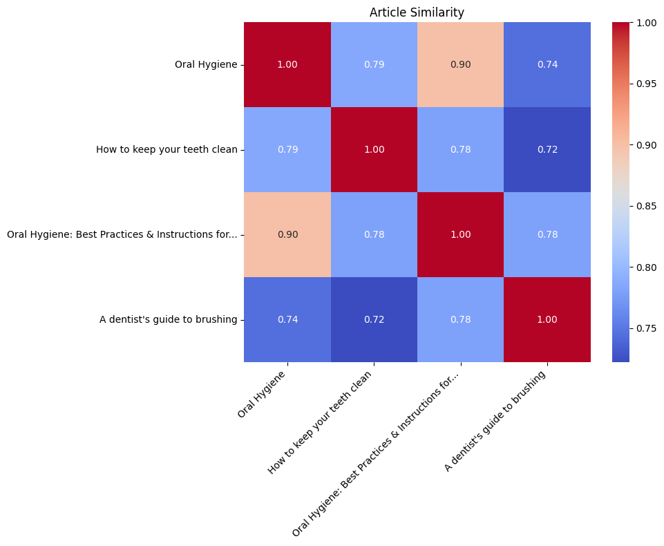

# Blog Post: Dental Content Generation with Google Gen AI

## Introduction

As the capabilities of generative AI continue to grow, so does the opportunity to build intelligent, domain-specific solutions. This project, developed as part of the **Capstone for the Gen AI Intensive Course with Google (March 31 – April 4, 2025)**, explores how Google’s generative tools can be used to generate, enrich, and compare dental-related content.

By combining **Google Gen AI**, **real-time web search**, **semantic embeddings**, and **visual analysis**, we’ve built a mini pipeline that automates content creation and comparison in the dentistry domain — a use case with real-world value for dental professionals, educators, and digital content teams.

---

## 🦷 Use Case & Value

Dental professionals, researchers, and content creators often need accurate, current, and readable information tailored to specific dental topics. However, manually gathering and filtering reliable content is time-consuming.

This project solves that by:

- Automating dental-specific content generation using AI.
- Integrating live Google Search to ground responses in real-time facts.
- Summarizing source articles in a clean, structured format.
- Measuring semantic similarity across articles to understand content overlap.
- Visualizing relationships to aid in quick decision-making or content curation.

---

## 🔧 How It Works — Code Walkthrough

### 1. **Configuring Google Search Tool**

To allow the AI model to fetch up-to-date web results:

```python
config_with_search = types.GenerateContentConfig(
    tools=[types.Tool(google_search=types.GoogleSearch())],
)
```

> *This ensures all responses are grounded in current web data — particularly important in a fast-evolving field like healthcare.*

---

### 2. **Domain-Specific Search Function**

A function enriches user queries with dental context and filters for relevance:

```python
def search_dental_domain(query):
    dental_query = f"In the context of dentistry, {query}"
    
    response = client.models.generate_content(
        model='gemini-2.0-flash',
        contents=dental_query,
        config=config_with_search,
    )

    dental_terms = ["dental", "dentistry", "tooth", "oral", "periodontal", "orthodontics"]
    filtered_text = next(
        (part.text for part in response.candidates[0].content.parts 
         if any(term in part.text.lower() for term in dental_terms)),
        "No dental content found."
    )
    
    return Markdown(filtered_text)
```

> *This step ensures we don’t just generate general information, but keep the output strictly focused on dentistry.*

---

### 3. **Summarizing Web Articles**

We use **few-shot prompting** and the `newspaper3k` library to summarize fetched web pages:

```python
def fetch_article(url):
    try:
        article = Article(url)
        article.download()
        article.parse()
        return article.title, article.text
    except:
        return None
```

```python
few_shot_prompt = """Highlight the title followed by Author and publishers. Then, summarize the article.

EXAMPLE:
**Title:** Over-the-counter pills better than opioids after dental surgery
**Author:** Matthew Solan and Dr. Howard LeWine
**Publisher:** Harvard Health Publishing
**Summary:** A combination of over-the-counter pain relievers is as effective as opioids...
"""
```

> *This makes the AI output structured and easy to interpret or embed into applications.*

---

### 4. **Semantic Similarity & Visualization**

Using embeddings and cosine similarity, we compare article summaries:

```python
response = client.models.embed_content(
    model='models/text-embedding-004',
    contents=texts.values(),
    config=types.EmbedContentConfig(task_type='semantic_similarity')
)

similarity_matrix = cosine_similarity([e.values for e in response.embeddings])
```

We visualize the matrix using a Seaborn heatmap:

```python
plt.figure(figsize=(10, 8))
sns.heatmap(similarity_matrix, annot=True, fmt=".2f", cmap="coolwarm",
            xticklabels=truncated_texts, yticklabels=truncated_texts)
plt.title("Article Similarity")
plt.show()
```

> *This offers a powerful overview of how different content sources relate to each other.*



---

## ⚠️ Limitations

While the project successfully demonstrates an intelligent Gen AI workflow, there are some limitations:

- **Model Hallucination**: Even with web grounding, the model may sometimes generate content that isn't perfectly accurate or verifiable.
- **Web Dependency**: If article links are broken or lack structure, summarization can fail.
- **No RAG or Vector Database Integration**: All similarity analysis is done in-session; persistent storage for embeddings would improve scaling.
- **Basic Filtering**: Keyword-based dental filtering may miss nuanced or emerging terms in dentistry.

---

## 🔮 Future Improvements

To take this further:

- Integrate with a **vector database** like FAISS or Pinecone for persistent semantic search.
- Use **Named Entity Recognition (NER)** to extract structured medical concepts beyond keywords.
- Apply **topic modeling** to categorize articles into themes (e.g., oral hygiene, orthodontics, surgery).
- Incorporate **feedback loops** to refine AI responses based on user ratings or accuracy checks.

---

## ✅ Conclusion

This project demonstrates a practical and valuable Gen AI application — tailored content generation and intelligent comparison for a specialized domain like dentistry.

By combining Google’s generative models, real-time search, summarization, and semantic analysis, we’ve created a system that can assist content creators, educators, and healthcare professionals alike.

The future of AI in healthcare content is bright — and this is just the beginning.